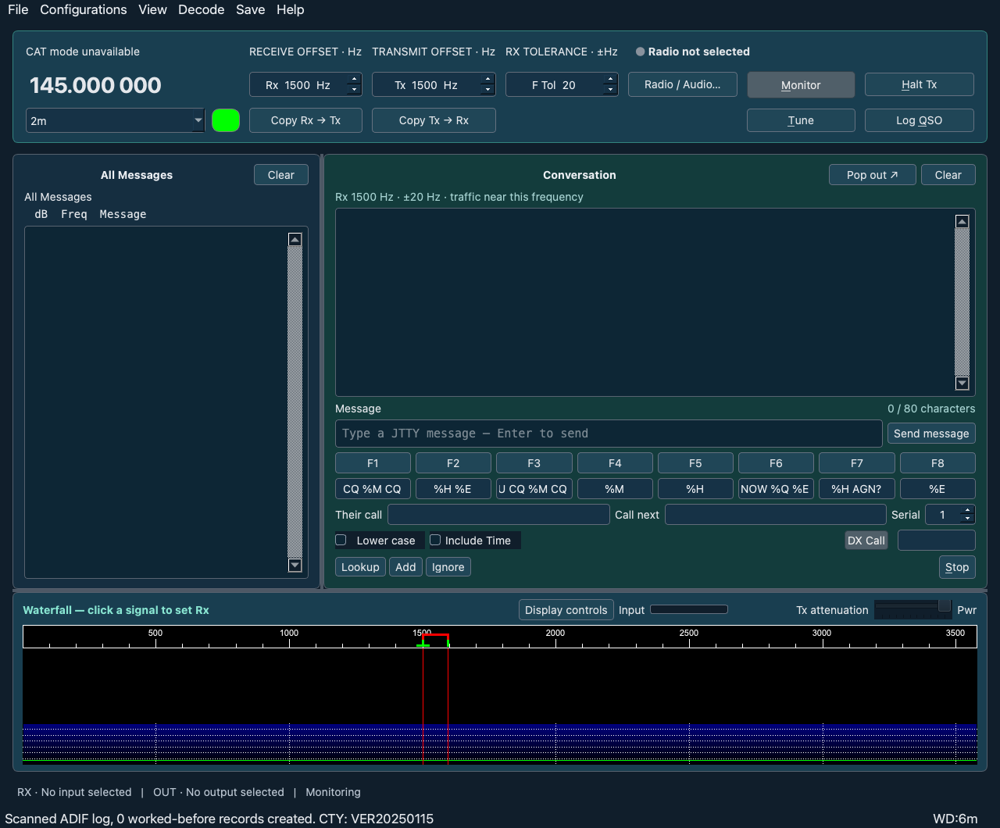

# Aurora JTTY 1.0


Aurora JTTY retains the existing JTTY Workbench settings, recordings and logs so upgrading preserves station configuration.

The current client is a JTTY-only fork of WSJT-X, using its Qt interface, receive/transmit audio, JTTY messaging, waterfall, frequency selector, station settings and Hamlib CAT/PTT control. GPLv3 or later. This independent build has no date-based expiration. The original Swift client remains in the repository for reference.

Open `build/Aurora JTTY.app`. This replacement uses separate settings from your installed WSJT-X and the old Swift client. Follow [the replacement setup guide](docs/WSJTX-JTTY-SETUP.md). Configure your callsign/grid, **Yaesu FT-710**, serial CAT port, and USB audio input/output in **Settings**. JTTY is the sole selectable operating mode. View → Themes selects Light gray, Dark, or a blue-and-green Aurora palette. View → Message font size adjusts decoded messages in All Messages and Conversation, plus the TX message entry, from 8 to 17 pt. All Messages shows every decoded signal; Conversation follows the selected receive offset. The interface uses JTTY-specific labels/help, and menus/settings limited to relevant features. It includes upstream JTTY frequency presets, including 7.090 MHz for 40 m.

The October 2 failed test showed the selected USB device becoming unavailable and returning under a new CoreAudio device ID while CAT polls continued. The replacement removes the custom Swift/CAT/audio-helper lifecycle. Hardware receive continuity and RF operation still need a radio test; software tests do not establish that the USB failure is fixed.

## App screenshot



Screenshot rendered from the current application in the GUI smoke test, with no radio attached. It shows the Aurora theme, All Messages, Conversation and waterfall; it does not demonstrate live radio reception.

## Licensing and publication

Aurora JTTY is an independent, unofficial fork based on WSJT-X. The covered application is licensed under **GNU GPL version 3 or later**. Original copyrights remain in force; no upstream endorsement is claimed.

- [Full GPL license](COPYING)
- [Third-party licenses and copyright attribution](THIRD_PARTY_NOTICES.md)
- [Publication requirements and current packaging limitations](docs/PUBLICATION-REQUIREMENTS.md)
- [Source provenance and independent-client licensing assessment](research/JTTY-LICENSING.md)
- [Preserved upstream trademark policy](research/WSJTX-TRADEMARK.md)
- [Preserved upstream documentation license policy](research/WSJTX-DOCS-LICENSE.md)
- [Original upstream copyright and license notice](research/WSJTX-license.adoc)

Binary releases require complete corresponding source, including the pinned upstream source and our modifications/build scripts, plus applicable dependency notices and source obligations. GitHub-generated source archives omit submodule contents; use the complete corresponding source archive attached to the release or clone with submodules. The current developer app depends on Homebrew libraries and is not a self-contained, signed or notarized public release.

Upstream end-user guides are separately licensed **CC BY-ND 4.0**. Preserve their attribution and redistribute them unmodified, or link to the originals; write independent documentation for this fork. This is separate from the software's GPL license. The review is not an exhaustive trademark, patent or final release-artifact clearance.

## macOS download

[Download the macOS Apple Silicon DMG](https://github.com/N4EAC/Aurora-JTTY/releases/download/v1.0/Aurora-JTTY-1.0-macOS-arm64.dmg) · [SHA-256 checksum](installers/Aurora-JTTY-1.0-macOS-arm64.dmg.sha256) · [Installation instructions](docs/MACOS-INSTALL.md)

This is an unsigned developer build requiring compatible Homebrew dependencies, not a standalone public installer. The DMG includes the application, corresponding source archive and legal notices. Recreate it with `sh scripts/package-macos-dmg.sh` after building the app.

## Windows 10/11

A Windows x64 version is feasible because the upstream Qt/C++/Fortran application and Hamlib support Windows builds. This repository's current build/package scripts target macOS; Windows is not yet built or verified. A Windows version needs a compatible Qt/MinGW/gfortran toolchain and dependencies, Aurora branding/resources, DLL deployment and CAT/PTT/audio testing on Windows. macOS-specific CoreAudio diagnostics are conditionally compiled and would use the Windows audio backend there. The legacy Swift client is not the Windows port.

## Build the WSJT-X-based client

With Xcode command-line tools and Homebrew:

```sh
brew install gcc fftw cmake hamlib qt@5 boost libusb portaudio
sh scripts/build-wsjtx-jtty.sh
sh scripts/test-wsjtx-jtty.sh
open "build/Aurora JTTY.app"
```

The source overlay is recreated from the unchanged pinned submodule by `scripts/prepare-wsjtx-jtty.py`. Other mode actions, quick buttons, selection slots, saved-profile mode restoration and command-line mode selection are restricted to JTTY; the common DSP library is retained intact. Upstream copyright and license notices are preserved.

The developer bundle depends on this machine's Homebrew libraries. It is not packaged or notarized for distribution. Keep it in the workspace.

The old Swift build remains available via `sh scripts/build.sh` and `sh scripts/test.sh`, and is no longer the preferred radio client.

Clone this repository with `git clone --recurse-submodules` or run `git submodule update --init --recursive` after cloning.

The required upstream checkout is pinned to `v3.2.0-rc1`, commit `567ad29ce6abf3d4a44f181cdbc7ceba0d73e5f4`. To restore it:

```sh
git clone --depth 1 --branch v3.2.0-rc1 https://github.com/WSJTX/wsjtx.git upstream/wsjtx
```

## Recorded-audio CLI

```sh
python3 client/jtty.py encode "CQ K1ABC CQ" build/cq.wav
python3 client/jtty.py decode build/cq.wav
python3 client/jtty.py decode upstream/wsjtx/samples/JTTY/260807_134110.wav
```

Input WAV files must be 12 kHz mono PCM16, at most 180 seconds. Messages support up to 80 characters and use upstream normalization. Output is JSON. Live audio converts the selected device's sample rate to the same decoder format.

## Source and verification

- `native/Audio.swift` and `native/qt-audio/`: bridge to upstream WSJT-X Qt capture, PCM conversion and CoreAudio playback.
- `native/Station.swift` and `LiveView.swift`: station workflow and interface.
- `native/radio.c`: Hamlib commands, serialization and timed PTT release.
- `native/live_bridge.f90`: streaming upstream decoder and encoder bindings.
- `native/engine.f90` and `client/jtty.py`: recorded-audio tools.
- `research/`: licensing, pinned provenance and verification results.

The PTT watchdog releases a timed transmission while this process and the control connection remain functional. It cannot guarantee release after forcible process termination or a disconnected USB cable. Stop/PTT OFF and graceful shutdown attempt immediate release and report failures.

See [verification details](research/PROTOTYPE-STATUS.md), `COPYING`, `THIRD_PARTY_NOTICES.md`, and [licensing research](research/JTTY-LICENSING.md). Preserve notices and provide corresponding source when distributing covered binaries. No upstream endorsement is claimed.

The original app icon is in `native/Assets`; regenerate it with `swift scripts/make-icon.swift native/Assets` followed by `iconutil -c icns native/Assets/JTTY.iconset -o native/Assets/JTTY.icns`.

See [the WSJT-X audio/CAT review](research/WSJTX-AUDIO-CAT-REVIEW.md) for architecture differences, the serial-control-line correction and remaining hardware limitations.

Receive capture now compiles the pinned upstream `Audio/soundin.cpp`, `Audio/AudioDevice.cpp`, and `Audio/AudioStreamDescriptor.cpp` directly. The Qt helper owns its audio thread and event loop; the Swift app receives selected-channel PCM16 through a pipe. This replaces the prior custom capture implementations. The helper requires Qt 5.15; Homebrew currently marks Qt 5 deprecated. The playback backend remains CoreAudio.
